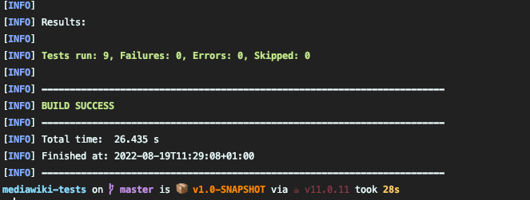

# MediaWiki Tests

Api tests for MediaWiki functionality using Rest Assured

## Project Dependencies
- Java 11
- Maven
- Lombok plugin for IDE and annotations enabled

## Approach
- My first step in understanding the task was to read through the documentation before creating any automated checks
- I found the documentation quite difficult to navigate through but needless to say this is the fun part of testing applications and software
- I studied the documentation and explored the application to answer a number of questions to help shape my approach. See below.

### Exploring and findings
I explored the following areas:
- What are the dependencies for each journey?
    - In order to generate valid tokens I needed an account which I created to be able to explore the functionality better.
    - Once I created an account, I recreated this request in postman and was able to obtain valid tokens with a valid session.
- Can I recreate the journeys that need to be tested?
    - I did this using the documentation available, using the Sandbox feature, and by creating my own postman collection. See [mediawiki.postman_collection.json](mediawiki.postman_collection.json)
    - I used a combination of the documentation and reference code to help me recreate the requests.
    - Whilst one can argue that the response is enough to validate, I wanted to see if the changes were available through other operations to validate the state and behaviour of an action.
- What are the validation rules for the APIs?
    - The documentation is vast and not the best laid out, so I focused on understanding the rules for the journeys I was testing.
    - Tokens are integral to be able to perform a lot of the functionality.
    - There wasn't any clear documentation on what a valid token looked like, and the fact that the `+\` was escaped in the json response as `+\\` was not obvious at first. However, with some trial and error I was able to understand this and able to login in successfully with a valid token.
- Where can I test?
  - I decided to stick with testing the functionality against test.wikipedia.com given that this is powered entirely by mediawiki and was the safest to test against.

## Automation
- After understanding the journey flows I decided to use a combination of rest assured and junit to create for the integration/journey tests.
- Given that these tests focus on the APIs, anything more than this felt like an overkill. The combination of JUnit as the runner and Rest Assured seemed like a good approach given the time available.

### Framework

The libraries used in this framework include:

- Rest Assured as the http client
- JUnit as the runner
- Surefire for reporting
- JUnit assertions and Hamcrest matchers along with the built-in assertions from Rest Assured

### Design Approach
- My initial approach was to get tests working for the journeys being tested, so at a high level I abstracted out concepts such as login, token generation, create and edit.
- Once I had the tests working, I applied DRY and OOP concepts to make the code cleaner.
- Cookies are required to be persisted for the journeys so this is done through the cookie filter object initialised and passed to all the requests in the tests.
- I've separated out the requests in their own classes to return the responses and to assert them in the tests, rather than coupling the requests and assertions in the test. This allows for reusability. 
- See structure below:

```
├── src
│   └── test
│       ├── java
│       │   ├── CreatePageTests.java
│       │   ├── EditPageTests.java
│       │   ├── LoginTests.java
│       │   ├── TokenGenerationTests.java
│       │   ├── requests
│       │   │   ├── BaseRequestSpecification.java
│       │   │   ├── EditPageRequests.java
│       │   │   ├── GetPageRevisionsRequest.java
│       │   │   ├── GetTokenRequests.java
│       │   │   ├── LoginRequests.java
│       │   │   └── LogoutRequests.java
│       │   └── utils
│       │       └── Helper.java
│       └── resources

```

### Additional implementation
- I've implemented setUp and tearDown steps for the tests as good practice
- I've included some negative, parameterised tests around valid. Given time, I would have liked to expand these further after understanding the functionality better.

### Running tests
To run all the tests: `mvn clean test`
To run all the tests and generate a html report: `mvn clean test site`

### Results
You can find the report under the /reports directory at the root. In total, 9 tests were implemented



## Improvements
Some improvements that I think can be made include:
- Whilst maps for query and form params is acceptable, there is a lot of hardcoded values in the tests, so to eliminate this the request and responses can be converted into DTOS. 
- I did try to model this with the edit page tests use a `Page` model and passed this in as a body to the POST request, but this did not quite work. I also tried setting the `Content-Type` header as well. I would have explored this further given the time.
- Things like credentials, urls and so forth can be extracted out into properties to allow the tests to be more readable and scalable to run on different environments.
- I have implemented github actions to build and run the tests. The tests run but some fail because of the IP range used being blacklisted by mediawiki. A potential around this would be to spoof the ip and pass this in the headers. See [results](https://github.com/imindersingh/mediawiki-tests/runs/7904661702?check_suite_focus=true#step:4:7086) here.
- For the testing, I would have liked to further explore the APIs using POISED to devise more tests around validation, functionality, edge cases and integrations